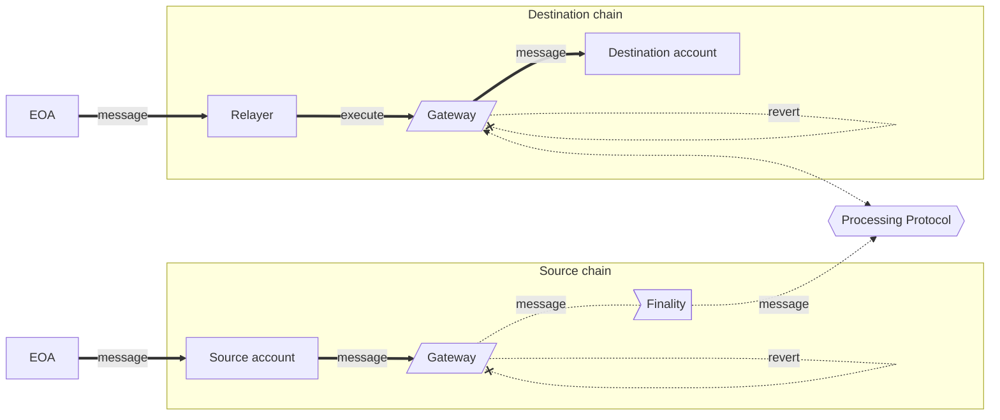

## Abstract

The following standard focuses on providing an unambiguous name to the different elements involved in cross-chain communication and defining some properties that these elements may or may not have. This is preparation work for a standard cross-chain communication interface.

## Motivation

Crosschain message-passing systems (or bridges) allow communication between smart contracts deployed on different blockchains. There is a large diversity of such systems with multiple degrees of decentralization, with various components, that implement different interfaces, and provide different guarantees to the users.

Their implementations often use protocol-specific language, which makes it challenging to transfer knowledge and reasoning from one system to another. Considering this scenario, the objective of the ERC is to provide a standard set of definitions and a list of formal properties to describe cross-chain communication protocols.

These properties are an exhaustive list. As such, they shall not be considered mandatory. Some of them might not be desirable depending on the objectives of the underlying protocol. However, a clear definition will help users determine what systems meet their needs in the clearest way possible.

## Specification

The keywords "MUST", "MUST NOT", "REQUIRED", "SHALL", "SHALL NOT", "SHOULD", "SHOULD NOT", "RECOMMENDED", "MAY", and "OPTIONAL" in this document are to be interpreted as described in RFC 2119.

### Definitions

#### Communication model

A representation of how messages are transmitted between chains. A general expectation of these chains is that they operate on their own clocks and are independent of each other. As such, the minimal secure model is that of an asynchronous message-passing system with a source account and a destination account.

More sophisticated functionalities such as synchronous delivery, multi-sends, and multi-hop can be implemented on top of the base protocol.

#### Source chain

The blockchain from which the cross-chain message is originating.

#### Source account

An account (often defined by an address) on the source chain that is sending the cross-chain message. In the context of an EVM source chain, this can be an EOA or a smart contract.

#### Destination chain

The blockchain to which the cross-chain message is intended.

#### Destination account

An account (often defined by an address) on the destination chain that is receiving the cross-chain message. In the context of an EVM destination chain, this can be an EOA or a smart contract.

#### Payload

The content of the message that is being sent. It includes source and destination (i.e. both chain and account) and the data contents (i.e. a bytes buffer).

#### Message

Messages are payloads with additional information attached, such as value or submission constrains (i.e. gas limit).

#### Source finality

The point in the communication model at which it is no longer possible to revert the submission of the message on the source chain.

#### Destination finality

The last point in the communication model at which the message can no longer be reverted on the destination chain. This is also the point at which the message is final to the system.

#### Processing Protocol

The set of rules that govern the transmission of messages between chains. Processing sits between the source and destination chains and is responsible for ensuring that messages are delivered.

#### Message creation

The process by which a message becomes available for submission on the source chain.

#### Message submission

Process by which the message is sent from the source chain to the processing protocol. May include message creation.

#### Message delivery

The process by which the message becomes available for execution on the destination chain. May include message execution.

#### Message execution

Process by which the message's payload is sent to the destination account. This generally implies executing the smart contract code at the destination account with the payload's data as input.

Execution may have a cost (e.g., gas on EVM chains), and thus, may revert due to an insufficient amount of funds available to cover costs. Similarly, execution may revert in case of an error on the executed code.

#### Relayer

An account that helps with message execution by relaying a transaction to the destination chain on behalf of the source account. Generally it's not able to alter the message's payload although it may be able to add additional execution parameters.

Some protocols facilitate relayers to execute message on the destination chain.

#### Gateway

A smart contract that serves as an entry point for messages to be sent between chains.

Some systems will require gateways on both the source chain and destination chains while other systems will only use one gateway. The presence and nature of the gateway varies radically between existing cross-chain message-passing systems.

### Communication Model Overview

### Properties

This section provides a list of properties that can be used to describe a cross-chain message-passing system. Not all systems have all the properties, and depending on the case, some of them may not be achievable or desirable.

#### Identifiability

> A message is uniquely identifiable.

This is a fundamental property that is required for other properties, such as **Non-Replayability** to make sense. All cross-chain systems SHOULD have this property.

#### Validity

> A payload is only executed on the target if the message was submitted by the requester.

This is a basic security property that all cross-chain systems SHOULD have.

#### Non-Replayability

> A message is successfully executed on the target at most one time.

This is a basic security property that all cross-chain systems SHOULD have.

#### Retriability

> A message's execution can be retried multiple times.

When combined with **Non-Replayability**, this property allows the message execution to be retried multiple times in case the execution fails, with the guarantee that the message will not be successfully executed more than once. This process can be used to achieve **Eventual Liveness**.

#### Ordered Execution

> Messages are executed in the same order as they were submitted

Most cross-chain systems do NOT have this property. In general, this property may not be desirable as it could lead to DoS.

A system that doesn't have this property is said to support **Out-of-order Execution**.

#### Duplicability

> A requester is able to send the same payload to the same target multiple times. Each request is seen as a different message.

When combined with **Non-Replayability**, each submission will be executed at most once, meaning that a payload will be executed on the target at most N times, with N the number of times it was submitted by the requester.

**TODO:** find a better name for this property ?

#### Liveness

> A message that was submitted is executed.

A weaker version of this property is **Eventual Liveness**:

> A message that was submitted is eventually executed, potentially after some external intervention.

**Eventual Liveness** can be achieved through **Retriability**.

#### Observability

> An observer is able to track the status of a message.

This property may be available with restrictions on who the observer is. For example, a system may provide observability to off-chain observers through an API/explorer, but at the same time not provide observability to the requester if the status of the message is not tracked on the source chain.

**TODO:** add more details about identifiers.

## Rationale

TODO

## Security Considerations

N/A

## Copyright

Copyright and related rights waived via [CC0](../LICENSE.md).
